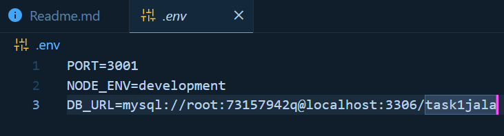
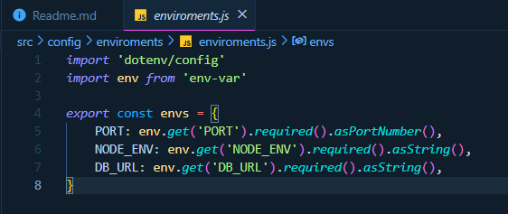
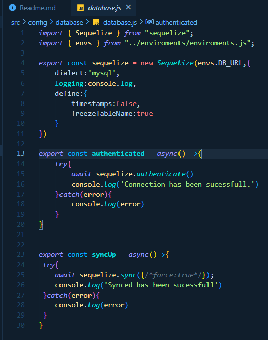
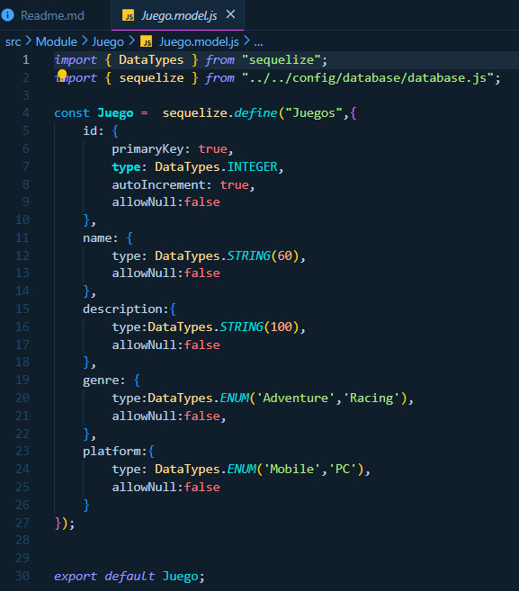
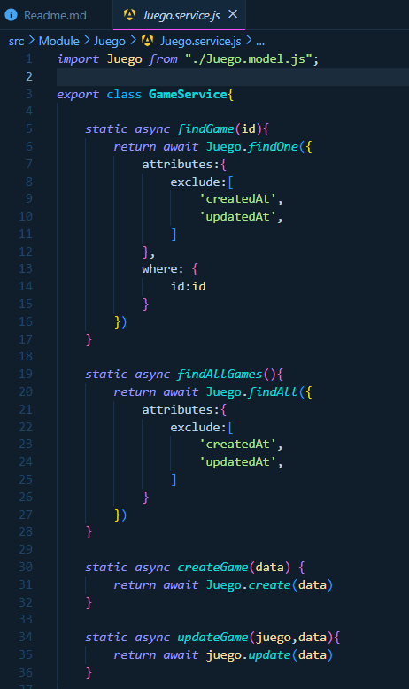

# ORM Best Practices for Node.js Applications
## Introduction
Object-Relational Mapping (ORM) libraries simplify the interaction between applications and databases by allowing developers to interact with the database using JavaScript objects instead of raw SQL queries. This guide explores best practices for integrating and using ORM libraries in Node.js applications, covering ORM selection, setup/configuration, model definition, querying, performance optimization, and handling relationships.

## **ORM Selection**
When selecting an ORM for a Node.js application, it's crucial to consider the features, community support, and suitability for the database type (SQL vs NoSQL). Here are comparisons of some popular ORM libraries:

### **Sequelize**

- **Features:** Sequelize is a promise-based ORM for Node.js and supports various SQL dialects (Postgres, MySQL, MariaDB, SQLite, and Microsoft SQL Server). It offers features like migrations, schema synchronization, and transaction management.

- **Community Support:** Strong community with extensive documentation and numerous plugins.

- **Suitability:** Best suited for SQL databases.

### **TypeORM**

- **Features:** TypeORM is an ORM that supports both SQL and NoSQL databases (MySQL, MariaDB, PostgreSQL, SQLite, Microsoft SQL Server, Oracle, and MongoDB). It offers support for migrations, decorators for defining models, and advanced querying.
- **Community Support:** Growing community with good documentation and active development.
- **Suitability:** Suitable for both SQL and NoSQL databases.

### **Mongoose**

- **Features:** Mongoose is an ODM (Object Data Modeling) library for MongoDB and Node.js. It provides schema-based solutions to model data, built-in type casting, validation, query building, and business logic hooks.
- **Community Support:** Very strong community with extensive documentation and tutorials.
- **Suitability:** Best suited for MongoDB (NoSQL).

## **Setup and Configuration**
#### **Database Connection Management:**

- Use connection pooling to manage database connections efficiently.
- Close database connections gracefully when the application shuts down.
#### **Environment-Specific Configurations:**

- Use environment variables to manage database configurations for different environments (development, testing, production).
- Store sensitive information such as database credentials in environment variables or secure configuration files.
#### **ORM Initialization:**

- Initialize the ORM library at the start of the application.
- Ensure that the database connection is established before handling any requests.

## Model Definition
#### **Defining Models:**

- Use clear and consistent naming conventions for model definitions.
- Define models in separate files to keep the codebase organized.
#### **Relationships:**

- Use associations (hasOne, hasMany, belongsTo, belongsToMany) to define relationships between models.
- Ensure referential integrity by defining foreign keys correctly.
#### **Validations:**

- Use built-in validation features provided by the ORM to enforce data integrity.
- Define custom validation functions for complex validation logic.

## Querying and Transactions
#### **Basic CRUD Operations:**

- Use the ORM's built-in methods for basic CRUD operations to ensure consistency and security.
#### **Advanced Querying:**

- Utilize features like eager loading to fetch related data in a single query.
- Use raw queries judiciously for complex operations that are not well-supported by the ORM.
#### **Transaction Management:**

- Use transactions to ensure data consistency in complex operations that involve multiple queries.
- Handle transaction commits and rollbacks appropriately to manage errors.

## Performance Optimization
#### **Eager Loading:**

- Use eager loading to minimize the number of database queries and fetch related data in a single query.
#### **Query Optimization:**

- Optimize queries by selecting only the required fields.
- Use indexes to improve query performance for frequently accessed fields.

#### **Caching:**
- Implement caching strategies to reduce the load on the database for frequently accessed data.
#### **Indexing:**

- Use database indexes to speed up queries on large datasets.
- Ensure that indexes are used judiciously to avoid performance degradation due to excessive indexing.